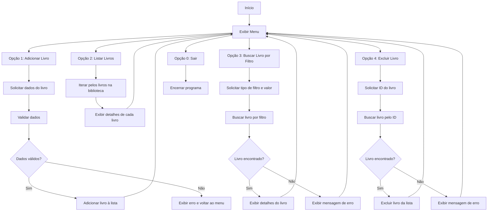

# Gerenciamento de Livros

Este é um sistema simples de gerenciamento de uma biblioteca de livros, desenvolvido em Python. Ele permite adicionar, listar, buscar e excluir livros da biblioteca, usando um menu interativo para o usuário.

## Funcionalidades

- **Adicionar Livro**: Permite adicionar um novo livro à biblioteca, fornecendo detalhes como nome, gênero, autor, ano e valor.
- **Listar Livros**: Exibe todos os livros cadastrados na biblioteca, com informações detalhadas de cada um.
- **Buscar Livro por Filtro**: Busca por um livro específico usando filtros como ID, nome, gênero, autor, ano ou valor.
- **Excluir Livro**: Remove um livro da biblioteca com base no seu ID.
- **Log de Operações**: Registra cada operação realizada, exibindo uma mensagem de log no console.

## Tecnologias Utilizadas

- **Python 3.x**: Linguagem principal do projeto.
- **UUID**: Utilizado para gerar IDs únicos para cada livro.
- **Funções Decoradoras**: Usadas para logar as operações realizadas no sistema.

## Como Executar o Projeto

1. Clone este repositório:
   ```bash
   git clone https://github.com/seu-usuario/seu-repositorio.git
   ```

2. Navegue até o diretório do projeto:
   ```bash
   cd nome-do-projeto
   ```

3. Execute o script principal:
   ```bash
   python3 nome_do_arquivo.py
   ```

4. O menu interativo será exibido no terminal, onde você poderá escolher entre as opções de adicionar, listar, buscar e excluir livros.

## Exemplo de Uso

### Menu Principal:
```
    Menu Livraria:
    1. Adicionar livros
    2. Listar livros
    3. Buscar livro por filtro
    4. Excluir livro
    0. Sair
```

### Adicionar Livro:
Para adicionar um novo livro, basta selecionar a opção 1 e inserir os dados solicitados:
```
Informe os dados necessários para adicionar o livro:
Nome: 1984
Gênero: Distopia
Autor: George Orwell
Ano: 1949
Valor: 45.00
Livro '1984' foi adicionado com sucesso, ID: 1a2b3c4d...
```

### Buscar Livro por Filtro:
Você pode buscar um livro específico usando filtros como ID, nome, gênero, autor, ano ou valor. Exemplo:
```
Selecione o filtro: 
1- ID | 2- Nome | 3- Gênero | 4- Autor | 5- Ano | 6- Valor
Defina o filtro: 2
Insira o nome do livro que deseja buscar: 1984
Livro encontrado:
    Livro:  1984
    Gênero: Distopia
    Autor:  George Orwell
    Ano:    1949
    Valor:  R$ 45.00
    ID: 1a2b3c4d...
```

### Excluir Livro:
Para excluir um livro, você deve informar o ID do livro a ser excluído:
```
Digite o ID do livro que deseja excluir: 1a2b3c4d...
Livro com ID '1a2b3c4d...' foi excluído com sucesso.
```

## Estrutura do Código

- **Classe Livro**: Representa cada livro com atributos como nome, gênero, autor, ano, valor e um ID único gerado automaticamente.
- **Funções Decoradas**: As funções principais (adicionar, listar, buscar, excluir) são decoradas para registrar logs de operações no terminal.
- **Gerador de Listagem**: Usa um gerador para iterar pela lista de livros ao listar os itens da biblioteca.

## Fluxograma:



## Contribuição

Se você quiser contribuir com este projeto:

1. Faça um fork do projeto.
2. Crie uma nova branch para a sua funcionalidade (`git checkout -b nova-funcionalidade`).
3. Commit suas alterações (`git commit -am 'Adiciona nova funcionalidade'`).
4. Envie para a branch (`git push origin nova-funcionalidade`).
5. Abra um Pull Request.

## Licença

Este projeto está sob a licença MIT. Veja o arquivo [LICENSE](LICENSE) para mais detalhes.
